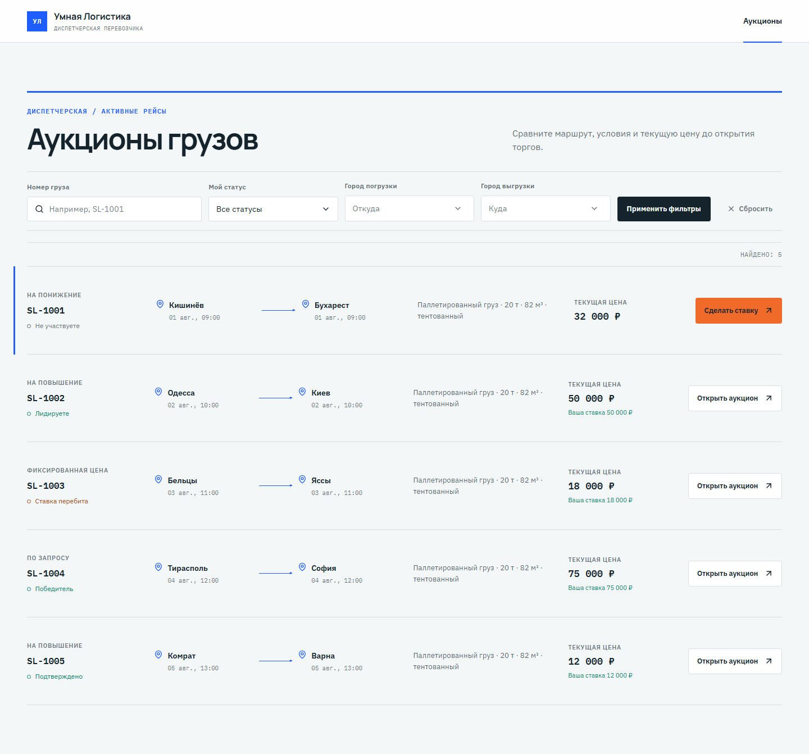
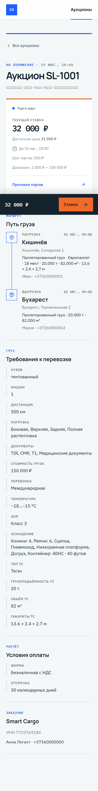
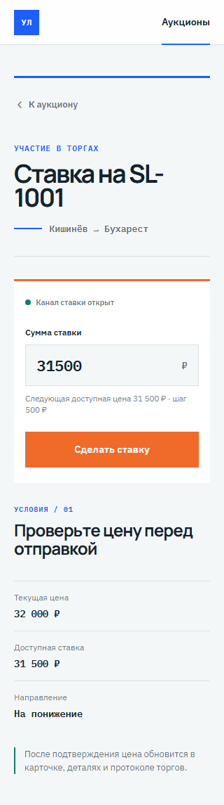
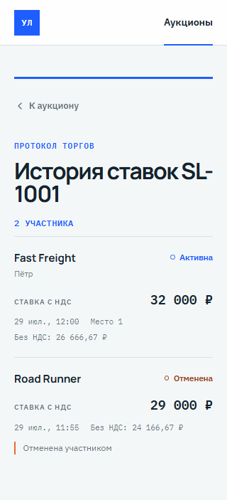

# Smart Logistics Auctions

SPA для работы диспетчера с грузовыми аукционами: фильтрация и пагинация списка, детальная карточка перевозки, протокол торгов и установка ставки. Проект выполнен по OpenAPI-контракту как тестовое задание на позицию Frontend-разработчика.



<p align="center">
  
  
  
</p>

## Запуск

Требования: Node.js `^20.19.0` или `>=22.12.0`, npm.

```bash
npm ci
npm run dev
```

Vite запустит dev-server; приложение нужно открыть по URL из консоли. Локальный stateful API перехватывается MSW Service Worker. Старт React ожидает готовности worker, поэтому первый экран не соревнуется с mock-запросами.

Основные команды:

| Команда | Назначение |
| --- | --- |
| `npm run dev` | development-сервер с browser MSW |
| `npm run api:generate` | обновить TypeScript DTO из OpenAPI |
| `npm run lint` | ESLint |
| `npm run typecheck` | TypeScript project references |
| `npm test` | unit и feature integration тесты |
| `npm run test:coverage` | тесты с coverage |
| `npm run test:e2e` | Playwright: desktop и mobile Chromium |
| `npm run build` | typecheck, production build и проверка отсутствия MSW в артефактах |

Перед первым E2E-запуском может понадобиться `npx playwright install chromium`.

## Маршруты

| URL | Экран |
| --- | --- |
| `/auctions` | список, URL-фильтры и пагинация |
| `/auctions/:auctionUuid` | детали перевозки и торгов |
| `/auctions/:auctionUuid/bets` | протокол торгов |
| `/auctions/:auctionUuid/bet` | напрямую открываемая форма ставки |

Неизвестные URL и UUID имеют отдельные recovery-состояния. Навигация остаётся внутри SPA; detail prefetch запускается по пользовательскому намерению.

## Архитектура

Проект следует Feature-Sliced Design:

```text
app       providers, router, bootstrap, global styles
pages     композиция route-level сценариев
widgets   список, детали, trading panel, история
features  фильтры, пагинация, установка ставки
entities  auction/bet API, query options, ViewModel, UI
shared    HTTP boundary, generated DTO, MSW, UI и test utilities
```

Распределение состояния:

- TanStack Query — серверное состояние и согласование кэша;
- TanStack Router — фильтры и пагинация в URL;
- Zustand — только локальное состояние mobile filter Drawer;
- React Hook Form + Zod — форма и точная decimal-safe валидация ставки;
- закрытая MSW database — единственный источник mock-данных.

Компоненты получают presentation-only ViewModel, а не сырой DTO. Центральная access policy удаляет закрытые данные до рендера: право ставки, история, адреса/контакты, стоимость груза и места участников проверяются независимо.

## OpenAPI и mock API

[`openapi.auctions.v0.json`](openapi.auctions.v0.json) — источник истины для transport-типов. `npm run api:generate` создаёт `src/shared/api/generated/auctions-api.ts`; ручной код использует только алиасы generated-схем через typed HTTP boundary с поддержкой `application/problem+json`.

MSW реализует реальные HTTP-сценарии `/api/v1`:

- POST списка с поддерживаемыми фильтрами и пагинацией;
- GET деталей по `main.order_uid`;
- GET истории с `all=true`;
- POST ставки с contract-shaped `403`, `404` и `422`;
- успешная ставка атомарно меняет list/detail/history, собственный статус и ранги.

После мутации приложение инвалидирует list, detail и bets queries. Оптимистическое обновление намеренно не используется: экраны синхронизируются через повторные HTTP-запросы к единому mock-store.

## Тестирование

Основная гарантия — feature integration тесты с настоящими Router, QueryClient, API client, Zustand и MSW Node. Unit-тесты оставлены для плотной чистой логики; Playwright проверяет пользовательские цепочки через browser Service Worker.

| Уровень | Проверяемые сценарии |
| --- | --- |
| Contract/API | заголовки и ошибки HTTP, фильтры, пагинация, stateful bid, reset store |
| Unit | URL parsing, request builder и timezone offsets, access policy, DTO → ViewModel, decimal step |
| Feature integration | список/фильтры/prefetch, прямые detail/bet/bets URL, query invalidation, скрытые данные, 401/404/503 и retry |
| E2E desktop | фильтр → детали → ставка → обновлённые детали и история |
| E2E mobile | Drawer → фильтр → sticky action → ставка |
| E2E guards | недоступная ставка, скрытая история без запроса, отсутствие contacts/address/cargo value/place |
| Production build | четыре ленивых route chunks, entry budget до 500 KiB и отсутствие MSW-артефактов |

Подробный ручной UI/a11y отчёт и все выбранные скриншоты: [`docs/verification/ui-review.md`](docs/verification/ui-review.md).

## Принятые допущения

- Авторизация вне scope: контракт описывает `401`, но не содержит security scheme.
- UUID маршрута берётся из `main.order_uid`.
- Справочник городов локальный: отдельного endpoint в схеме нет.
- Количество участников — число уникальных `subscriber_id`.
- История запрашивается с `all=true`, чтобы показывать отменённые ставки.
- Date-only фильтры превращаются в ISO 8601 с offset локальной временной зоны для каждой границы.
- Шаг ставки считается decimal-safe относительно `available`, при его отсутствии — относительно `min`.
- Ставка разрешена только при явном `can_set_bet: true`.
- История скрыта, если флаг установлен либо в корне detail, либо внутри `trading`.

## Ограничения

- Реального backend и auth-flow нет; mock-state живёт только в runtime страницы и сбрасывается после перезагрузки.
- Production bundle намеренно не содержит MSW и ожидает доступный `/api/v1`.
- `npm audit --omit=dev` не находит уязвимостей; полный audit сообщает о 4 high severity advisory в dev-only цепочке генератора OpenAPI.
- E2E выполняются в Chromium desktop/mobile emulation; реальные iOS Safari и Android устройства не проверялись.
- Автоматического accessibility scanner нет; семантика, focus order, contrast, reduced motion и overflow проверялись вручную и сценарными тестами.
- Четыре route-level экрана загружаются лениво. Финальный entry chunk — 342.56 kB / 105.76 kB gzip; build падает, если entry превысит 500 KiB, исчезнет route chunk или в production попадёт MSW.

Описание использования AI: [`AI_USAGE.md`](AI_USAGE.md).
